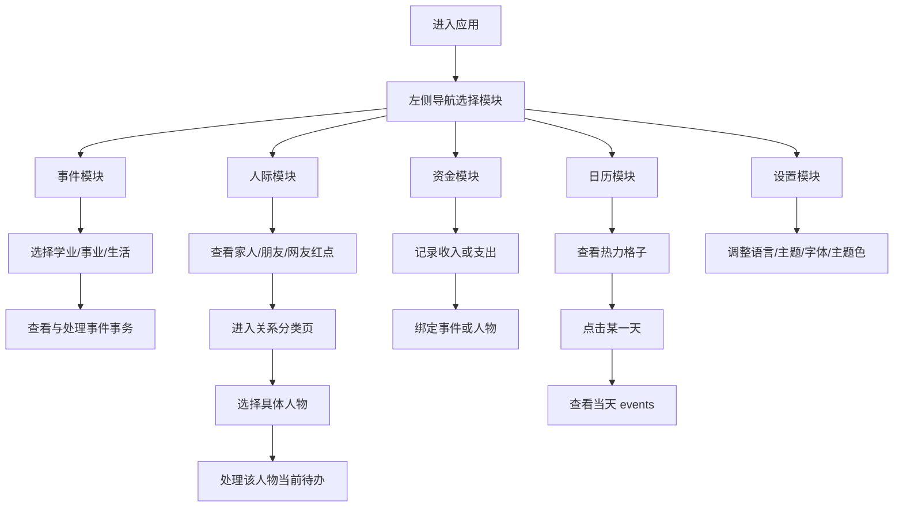

## 1. 产品概述
这是一款桌面优先的个人生活管理软件，以“事件、人际、资金、日历”四条主线组织个人生活信息，帮助用户长期管理学业、事业、生活、人际关系与资金流动。
- 主要解决待办分散、关系事务难追踪、时间提醒不直观、资金记录与具体事件脱节的问题。
- 产品价值在于把“人”和“事”统一进一个美观、长期可用、层级清晰的工作台里。

## 2. 核心功能

### 2.1 用户角色
本产品第一版仅考虑单用户使用场景，不区分多角色权限。

| 角色 | 注册方式 | 核心权限 |
|------|----------|----------|
| 普通用户 | 本地使用 / 后续支持账户登录 | 管理事件、人际、资金、日历与个性化设置 |

### 2.2 功能模块
1. **事件首页**：学业、事业、生活三类事件入口，展示近期事件与今日重点。
2. **事件分类页**：查看某个事件分类下的全部事务，并进行新增、完成、编辑。
3. **人际首页**：家人、朋友、网友三类关系入口，以人物为主导展示当前需要处理的人。
4. **关系分类页**：以类似聊天列表的方式展示该关系下的具体人物和未完成事务数量。
5. **人物详情页**：查看单个人物档案、当前待办、历史记录、资金关联。
6. **资金首页**：展示收入、支出概览与近期资金流动，并支持与事件或人物建立关联。
7. **资金记录详情页**：查看某笔收入或支出的完整信息。
8. **日历页**：以 GitHub 风格热力格子展示每日事件活跃度，并支持点击查看当天 events。
9. **当日事件页**：展示某一天的所有事件与提醒。
10. **设置页**：中英双语、亮暗模式、字体大小、7 种主题色、提醒开关等基础设置。

### 2.3 页面详情
| 页面名称 | 模块名称 | 功能描述 |
|-----------|-------------|---------------------|
| 事件首页 | 三分类卡片 | 展示学业、事业、生活三个入口，并显示分类摘要 |
| 事件首页 | 今日重点 | 展示今天最重要的 3 到 5 条事件事务 |
| 事件分类页 | 事务列表 | 按分类查看事务、完成事务、编辑事务 |
| 人际首页 | 关系分类卡片 | 展示家人、朋友、网友，并显示红点未完成数量 |
| 人际首页 | 人际看板 | 以人物为主导展示需要处理的人与最近一条待办摘要 |
| 关系分类页 | 人物列表 | 按人物展示未完成事务数，交互类似聊天列表 |
| 人物详情页 | 当前待办 | 展示该人物当前未完成事项，支持一键点掉并隐藏 |
| 人物详情页 | 历史记录 | 展示已完成事项与过往互动记录 |
| 资金首页 | 收支概览 | 展示本周、本月收入与支出汇总 |
| 资金首页 | 近期资金流 | 按时间倒序展示近期资金记录 |
| 日历页 | 热力格子 | 用颜色深浅表现每天事件数量和活跃程度 |
| 当日事件页 | 当日列表 | 展示当天全部 events，并支持跳转事务或人物详情 |
| 设置页 | 个性化设置 | 管理语言、主题模式、字体大小、主题色和通知开关 |

## 3. 核心流程
用户以左侧固定导航为主入口，在事件、人际、资金、日历之间切换；其中事件模块以“事”为主导，人际模块以“人”为主导，资金模块以“资金流”为主导，日历模块以“时间”为主导。

主要用户流程：
1. 用户进入事件模块，按学业、事业、生活分类管理个人事务。
2. 用户进入人际模块，先看到家人、朋友、网友三类关系以及各自红点数量，再进入某个人物页集中处理待办。
3. 用户在人物页完成事务后，对应人物和分类红点自动递减，待办从当前列表移除。
4. 用户进入资金模块记录收入与支出，并把资金记录绑定到具体事件或人物。
5. 用户进入日历热力图查看某一天的事件密度，并进入当天详情查看全部 events。
6. 用户通过设置页调整中英双语、亮暗模式、字体大小和主题色。

## 4. 用户界面设计
### 4.1 设计风格
- 主色与辅助色：采用用户可切换的 7 种主题色，默认建议使用森林绿；资金模块中收入为绿色、支出为红色。
- 按钮风格：圆角矩形按钮，主按钮用主题色高亮，次级按钮使用低饱和描边风格。
- 字体与字号：中文优先使用更有人文气质的无衬线字体组合；支持小、中、大三档字号。
- 布局风格：桌面优先，左侧固定导航栏，右侧主画布；关系页采用卡片化和列表混合布局。
- 图标与徽标：使用克制、清晰的线性图标；红点采用白字红底的小圆角徽标。

### 4.2 页面设计概览
| 页面名称 | 模块名称 | UI 元素 |
|-----------|-------------|-------------|
| 事件首页 | 三分类卡片 | 卡片布局、主题色高亮、简洁分区、轻量阴影 |
| 人际首页 | 人际看板 | 人物列表、红点计数、最近待办摘要、层级清晰 |
| 关系分类页 | 人物列表 | 类似聊天列表的纵向结构、头像、摘要、红点数字 |
| 人物详情页 | 当前待办区 | 明确分区、状态切换按钮、时间标签、历史列表 |
| 资金首页 | 收支总览 | 绿色与红色对比、数字卡片、时间序列记录 |
| 日历页 | 热力格子 | GitHub 风格热力图、月度/年度切换、图例说明 |
| 设置页 | 主题设置 | 即时预览、主题色样本卡片、简洁开关控件 |

### 4.3 响应式
- 采用桌面优先设计，优先适配大屏工作台体验。
- 中等屏幕下降级为窄左栏 + 右侧自适应内容区。
- 移动端作为后续适配目标，第一版仅保证基础可用，不追求完整体验一致性。

