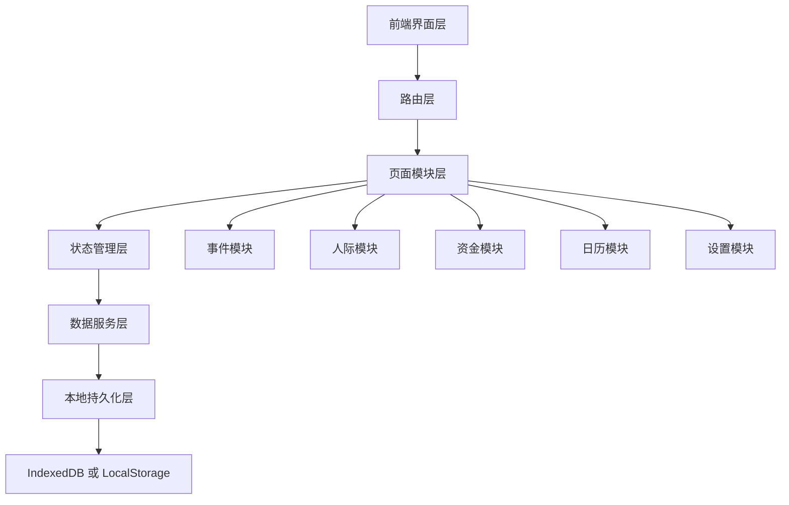
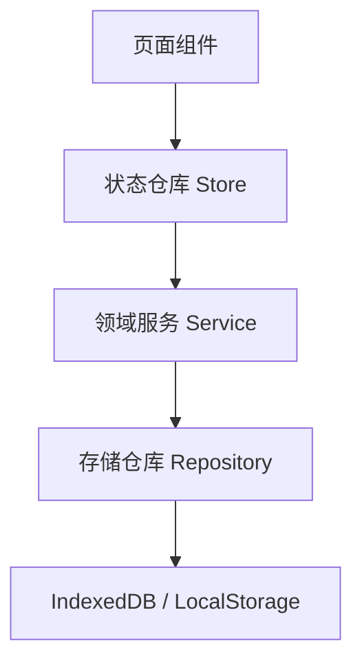
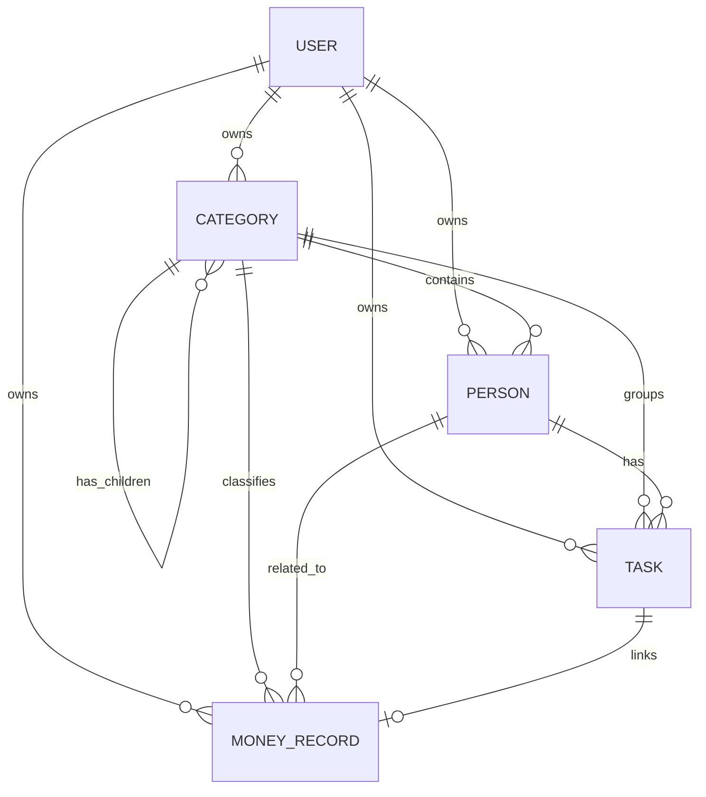

## 1. 架构设计


## 2. 技术说明
- 前端：React@18 + TypeScript + Vite
- 样式方案：Tailwind CSS@3 + CSS Variables
- 路由：React Router
- 状态管理：Zustand
- 图标：Lucide React
- 日期处理：dayjs
- 数据持久化：第一版优先本地存储，建议使用 IndexedDB；简化方案可先落 LocalStorage
- 后端：第一版无独立后端
- 数据库：第一版无远程数据库，使用本地数据模拟与持久化
- 初始化工具：Vite

技术原则：
1. 第一版先做纯前端单机版本，尽快验证产品结构和交互。
2. 红点计数、热力图聚合、筛选结果都在前端本地完成。
3. 后续如需多端同步，再引入服务端和账户系统。

## 3. 路由定义
| 路由 | 用途 |
|-------|---------|
| `/` | 默认重定向到事件首页 |
| `/events` | 事件首页 |
| `/events/:categoryId` | 事件分类页 |
| `/social` | 人际首页 |
| `/social/:relationId` | 关系分类页 |
| `/social/person/:personId` | 人物详情页 |
| `/money` | 资金首页 |
| `/money/:recordId` | 资金记录详情页 |
| `/calendar` | 日历页 |
| `/calendar/:date` | 当日事件页 |
| `/settings` | 设置页 |

## 4. API 定义
第一版不引入后端 API，统一采用前端本地服务层封装数据访问，接口风格保持与未来 API 一致。

TypeScript 核心类型建议如下：

```ts
type ThemeMode = "light" | "dark";
type ThemeColor =
  | "forest"
  | "ocean"
  | "apricot"
  | "mist"
  | "lavender"
  | "rose"
  | "amber";

type CategoryType =
  | "event_root"
  | "event_group"
  | "social_root"
  | "social_group"
  | "money_root"
  | "money_group";

type TaskStatus = "pending" | "completed" | "cancelled";
type TaskTimeType = "exact_time" | "relative_time" | "long_term" | "range_time";
type TaskModuleType = "event" | "social";
type MoneyType = "income" | "expense";

interface UserSettings {
  language: "zh-CN" | "en-US";
  themeMode: ThemeMode;
  themeColor: ThemeColor;
  fontSize: "small" | "medium" | "large";
  notificationsEnabled: boolean;
}

interface Category {
  id: string;
  userId: string;
  name: string;
  type: CategoryType;
  parentId: string | null;
  sortOrder: number;
  icon?: string;
  color?: string;
  pendingCount: number;
  createdAt: string;
  updatedAt: string;
}

interface Person {
  id: string;
  userId: string;
  categoryId: string;
  name: string;
  nickname?: string;
  avatarUrl?: string;
  relationType: "family" | "friend" | "online_friend";
  birthday?: string;
  anniversary?: string;
  note?: string;
  lastContactAt?: string;
  contactPreference?: string;
  pendingCount: number;
  createdAt: string;
  updatedAt: string;
}

interface Task {
  id: string;
  userId: string;
  title: string;
  description?: string;
  moduleType: TaskModuleType;
  categoryId: string;
  personId?: string;
  moneyRecordId?: string;
  status: TaskStatus;
  priority: "low" | "medium" | "high";
  timeType: TaskTimeType;
  dueAt?: string;
  startAt?: string;
  remindAt?: string;
  isDeleted: boolean;
  completedAt?: string;
  createdAt: string;
  updatedAt: string;
}

interface MoneyRecord {
  id: string;
  userId: string;
  type: MoneyType;
  amount: number;
  currency: string;
  title: string;
  note?: string;
  occurredAt: string;
  relatedTaskId?: string;
  relatedPersonId?: string;
  relatedCategoryId: string;
  createdAt: string;
  updatedAt: string;
}

interface CalendarDaySummary {
  date: string;
  eventCount: number;
  heatLevel: number;
  items: Array<{
    taskId: string;
    title: string;
    moduleType: TaskModuleType;
    categoryName: string;
    personName?: string;
    status: TaskStatus;
    dueAt?: string;
  }>;
}
```

## 5. 服务层架构图
第一版没有服务端，但前端内部建议使用清晰的服务层结构。



推荐服务拆分：
1. `categoryService`
2. `personService`
3. `taskService`
4. `moneyService`
5. `calendarService`
6. `settingsService`

## 6. 数据模型
### 6.1 数据模型定义


### 6.2 数据定义语言
第一版采用前端本地存储，不强制使用真实 SQL，但为了后续演进，可以先定义表结构。

```sql
CREATE TABLE users (
  id TEXT PRIMARY KEY,
  display_name TEXT NOT NULL,
  avatar_url TEXT,
  language TEXT NOT NULL DEFAULT 'zh-CN',
  theme_mode TEXT NOT NULL DEFAULT 'light',
  theme_color TEXT NOT NULL DEFAULT 'forest',
  font_size TEXT NOT NULL DEFAULT 'medium',
  created_at TEXT NOT NULL,
  updated_at TEXT NOT NULL
);

CREATE TABLE categories (
  id TEXT PRIMARY KEY,
  user_id TEXT NOT NULL,
  name TEXT NOT NULL,
  type TEXT NOT NULL,
  parent_id TEXT,
  sort_order INTEGER NOT NULL DEFAULT 0,
  icon TEXT,
  color TEXT,
  pending_count INTEGER NOT NULL DEFAULT 0,
  created_at TEXT NOT NULL,
  updated_at TEXT NOT NULL
);

CREATE TABLE persons (
  id TEXT PRIMARY KEY,
  user_id TEXT NOT NULL,
  category_id TEXT NOT NULL,
  name TEXT NOT NULL,
  nickname TEXT,
  avatar_url TEXT,
  relation_type TEXT NOT NULL,
  birthday TEXT,
  anniversary TEXT,
  note TEXT,
  last_contact_at TEXT,
  contact_preference TEXT,
  pending_count INTEGER NOT NULL DEFAULT 0,
  created_at TEXT NOT NULL,
  updated_at TEXT NOT NULL
);

CREATE TABLE tasks (
  id TEXT PRIMARY KEY,
  user_id TEXT NOT NULL,
  title TEXT NOT NULL,
  description TEXT,
  module_type TEXT NOT NULL,
  category_id TEXT NOT NULL,
  person_id TEXT,
  money_record_id TEXT,
  status TEXT NOT NULL DEFAULT 'pending',
  priority TEXT NOT NULL DEFAULT 'medium',
  time_type TEXT NOT NULL,
  due_at TEXT,
  start_at TEXT,
  remind_at TEXT,
  is_deleted INTEGER NOT NULL DEFAULT 0,
  completed_at TEXT,
  created_at TEXT NOT NULL,
  updated_at TEXT NOT NULL
);

CREATE TABLE money_records (
  id TEXT PRIMARY KEY,
  user_id TEXT NOT NULL,
  type TEXT NOT NULL,
  amount REAL NOT NULL,
  currency TEXT NOT NULL DEFAULT 'CNY',
  title TEXT NOT NULL,
  note TEXT,
  occurred_at TEXT NOT NULL,
  related_task_id TEXT,
  related_person_id TEXT,
  related_category_id TEXT NOT NULL,
  created_at TEXT NOT NULL,
  updated_at TEXT NOT NULL
);

CREATE INDEX idx_categories_parent_id ON categories(parent_id);
CREATE INDEX idx_persons_category_id ON persons(category_id);
CREATE INDEX idx_tasks_category_id ON tasks(category_id);
CREATE INDEX idx_tasks_person_id ON tasks(person_id);
CREATE INDEX idx_tasks_status ON tasks(status);
CREATE INDEX idx_money_records_related_person_id ON money_records(related_person_id);
```

初始数据建议：
1. 预置根分类：事件、人际、资金。
2. 预置事件子分类：学业、事业、生活。
3. 预置人际子分类：家人、朋友、网友。
4. 预置资金子分类：收入、支出。
5. 预置默认设置：中文、亮色、森林绿、中字号。

